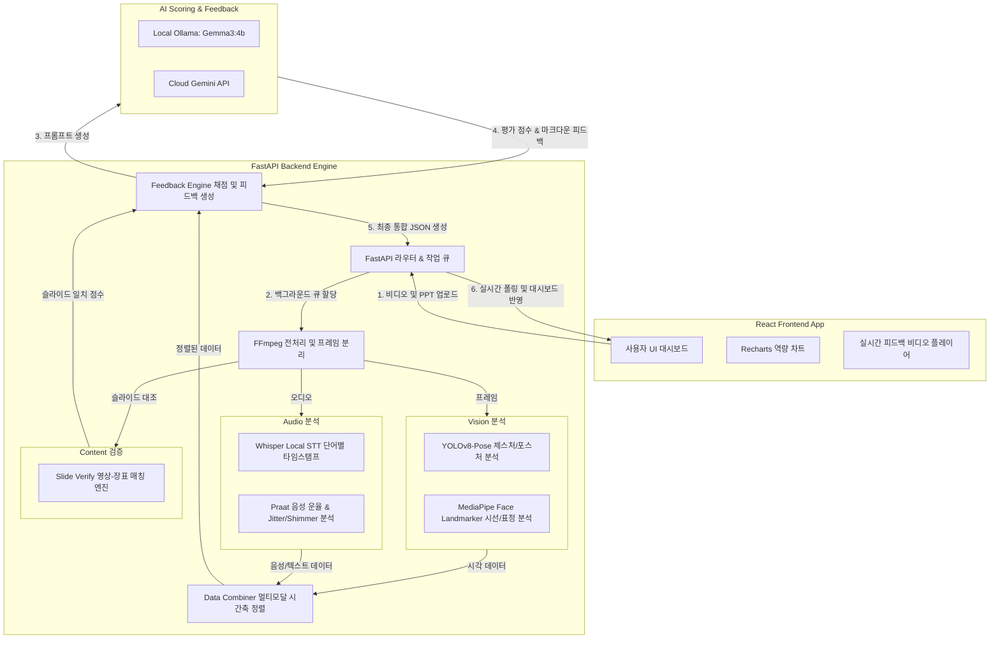

# 🌙 Overnight.AI : AI 기반 발표 및 스피치 멀티모달 자동 평가 시스템
**Overnight.AI**는 발표자의 **영상(Vision), 음성(Audio), 언어/슬라이드(Text/PPT)** 데이터를 초정밀 멀티모달 파이프라인으로 동적 분석하여 계측된 정량적 수치를 바탕으로 발표 역량을 다각도로 평가하고 맞춤형 피드백을 제공하는 스피치 코칭 서비스입니다. 
본 프로젝트는 고도화된 딥러닝 분석 엔진(FastAPI)과 반응형 시각화 대시보드(React)가 결합되어 동작합니다.

---

## 🏗️ System Architecture (시스템 구조)

---

## ✨ Key Features (핵심 기능)

1. **초정밀 멀티모달 데이터 정렬 및 분석 (Multi-modal Data Fusion)**
* FFmpeg를 통해 입력 영상을 비언어 분석용 프레임 이미지와 오디오 트랙으로 순식간에 물리 분리합니다.
* **시각**: YOLOv8-Pose를 활용해 어깨 Yaw 각도 변위와 손목 3D 변위를 실시간 연산하여 자세 및 제스처(팔짱 감지 등) 상태를 판별하며, MediaPipe를 통해 정밀 시선 집중도와 미소를 추적합니다.
* **음성**: Whisper Local을 활용해 형태소 단위의 텍스트와 정확한 타임스탬프를 추출하고, Praat으로 피치 변화, 발화 평정심 지수 및 Jitter/Shimmer 기반 음성 안정도를 산출합니다.
* **정렬**: 이질적인 타임스탬프를 가진 비언어(시각) 정보와 언어(음성) 텍스트를 문장 단위 시간축으로 병렬 융합(`align_data`)합니다.


2. **영상-슬라이드 실시간 일치 검증 (Slide Verification Engine)**
* 업로드된 PPT 파일에서 추출한 장표 이미지와 영상 내 스크린 영역을 비교 분석하여 현재 발표 내용과 슬라이드가 얼마나 잘 동기화되고 있는지 검증합니다.
* 종합 일치율(%), 슬라이드 커버리지(%), 그리고 뒤바뀐 슬라이드 순서 및 잘못 매핑된 타임라인 이슈를 시각적으로 가시화합니다.


3. **100점 만점 기준의 AI 객관적 정량 평가 (Scorecard Dashboard)**
* **발표 태도(Attitude - 20점)**: 시선 집중도(10), 제스처 및 포스쳐(10)
* **음성 유창성(Voice - 30점)**: 음성 안정도(10), 스피치 평정심 지수(10), 필러 워드 제어력(10)
* **자료 및 내용(Content - 50점)**: 발화-PPT 싱크(15), 발화 완성도(10), 가독성/디자인(15), 테마 일관성(10)
* 평가 결과를 Radar 및 Pie 차트로 한눈에 시각화하고, 실시간 비디오 재생 속도에 매핑하여 동적 피드백(자막 팁 형태)을 제공합니다.


4. **문서 기반 AI 챗봇 멘토 (Chatbot Mentor)**
* 사용자가 PPT 파일을 첨부하거나 일반 질문을 올리면, Gemini API를 통해 발표 대본 작성 요령, 슬라이드 레이아웃 피드백 및 내용 교정을 위한 대화형 가이드를 지원합니다.


---

## 🛠️ Tech Stack (기술 스택)

### Frontend

* **Framework & Build**: React 18, Vite 5, TypeScript 5
* **Routing & State**: React Router DOM 6
* **Visualization**: Recharts (도넛/레이더 차트)
* **Document Export**: jsPDF, jsPDF-AutoTable (PDF 출력), XLSX (Excel 스프레딧 출력)
* **Styling**: Vanilla CSS (Premium Dark/Glassmorphic 테마 반영)

### Backend

* **Core Engine**: Python 3.9+, FastAPI, Uvicorn
* **Media Processing**: FFmpeg
* **Computer Vision**: OpenCV, Ultralytics YOLOv8 (Pose Model), MediaPipe (Face Landmarker)
* **Speech Processing**: OpenAI Whisper (Local base model), Praat-parselmouth (운율 분석)
* **AI Scoring & Chat**: Ollama (Gemma3:4b 로컬 모델), Google Gemini API (Client SDK)

---

## 📂 Project Structure (프로젝트 디렉토리 구조)

```bash
Capstone2/
├── Capstone2Back/                 # 백엔드 서버 프로젝트 루트
│   └── CapstoneDesign_Server/
│       ├── core/                  # 핵심 클라이언트 및 비즈니스 엔진
│       │   ├── feedback_engine.py # 피드백 채점 & 보고서 생성 (Gemma/Gemini)
│       │   ├── gemini_client.py   # Gemini API 클라이언트 & 파일 업로드
│       │   └── llama_client.py    # Local Ollama (Gemma3) 클라이언트
│       ├── processing/            # 멀티모달 원시 데이터 분석 파이프라인
│       │   ├── task_manager.py    # 6단계 비동기 작업 큐 및 분석 스케줄링
│       │   ├── video_analyzer.py  # FFmpeg 기반 전처리 (비디오/오디오 분리)
│       │   ├── face_analyzer.py   # MediaPipe 기반 시선/표정 추적
│       │   ├── gesture_analyzer.py# YOLOv8 Pose 기반 제스처 및 어깨 각도 연산
│       │   ├── audio_analyzer.py  # Whisper STT & Praat 피치 추출
│       │   └── data_combiner.py   # 시·청각 시계열 매핑 (Data Fusion)
│       ├── slide_verify/          # PPT-영상 동기화 매칭 서비스
│       ├── ppt-analysis-engine/   # PPT 가독성 및 디자인 분석기
│       ├── main.py                # FastAPI 엔트리포인트 (API 라우터 및 Lifespan 제어)
│       └── requirements.txt       # 백엔드 파이썬 패키지 의존성 목록
│
└── Capstone2Front/                # 프론트엔드 웹 애플리케이션 루트
    ├── public/
    ├── src/
    │   ├── components/            # 공통 헤더, 레이아웃, 아이콘 컴포넌트
    │   ├── context/               # Firestore 동기화 및 전역 스토리지 컨텍스트
    │   ├── data/                  # API 데이터 로컬 저장소 및 채점 루브릭 정의
    │   ├── pages/                 # 분석 리포트 대시보드, 업로드 페이지, AI 챗봇 화면
    │   │   ├── Analysis.tsx       # 차트 시각화 및 실시간 피드백 대시보드
    │   │   ├── Evaluate.tsx       # 분석 의뢰 및 파일 전처리 폼
    │   │   └── Chatbot.tsx        # 발표 코칭 전용 파일 첨부형 AI 챗봇
    │   ├── utils/
    │   │   └── exportReport.ts    # PDF 및 Excel 포맷 정밀 내보내기 유틸리티
    │   ├── app.tsx
    │   └── main.tsx
    ├── package.json               # 프론트엔드 npm 패키지 설정
    └── vite.config.ts             # Vite 빌드 설정

```

---

## 🚀 Getting Started (설치 및 실행 가이드)

### Prerequisites (사전 준비 사항)

* [Node.js](https://nodejs.org/) (v18 이상 권장)
* [Python](https://www.python.org/) (v3.9 ~ v3.11 권장)
* [FFmpeg](https://ffmpeg.org/) (시스템 환경 변수 `PATH`에 등록 필수)
* [Ollama](https://ollama.com/) (로컬 모델 구동기)

---

### 1. Ollama 로컬 모델 설정

로컬 환경에서 제미나이 크레딧 없이 무제한으로 피드백 엔진을 구동하기 위해 Gemma 3 4B 모델을 설치합니다.

```bash
# Ollama 설치 후 터미널에 입력하여 Gemma 3 4B 모델 다운로드 및 실행
ollama run gemma3:4b

```

---

### 2. Backend Server 설치 및 가동

```bash
# 1. 백엔드 디렉토리로 이동
cd Capstone2Back/CapstoneDesign_Server
# 2. 가상환경 생성 및 활성화 (Windows 가이드)
python -m venv venv
.\venv\Scripts\activate
# 3. 필수 패키지 설치
pip install -r requirements.txt
# 4. 환경 변수 파일 생성 (.env 파일 작성)
# CapstoneDesign_Server 폴더 내에 `.env` 파일을 만들고 아래 설정값을 작성합니다.

```

#### `.env` 설정 세부 정보:

```env
# Gemini API Key (선택사항: AI 챗봇 및 클라우드 피드백 사용시 필수)
GEMINI_API_KEY=your-gemini-api-key-here
# AI 피드백 엔진 모드 설정
# - gemma: 로컬 CPU/GPU의 Ollama 사용 (평소 개발/연구용, 무료로 무제한 사용 가능)
# - gemini: 구글 클라우드 고속 API 사용 (최종 시연/배포용, 크레딧 소진 시 429 오류 발생)
AI_PROVIDER=gemma

```

```bash
# 5. 백엔드 서버 가동 (FastAPI 기본 포트 8000번 가동)
python main.py

```

---

### 3. Frontend Web App 설치 및 가동

```bash
# 1. 프론트엔드 디렉토리로 이동
cd Capstone2Front
# 2. npm 패키지 의존성 설치 (누락된 패키지 포함 일괄 설치)
npm install
# 3. 로컬 개발 서버(Vite) 실행
npm run dev

```

터미널에 안내되는 로컬 주소(기본값: `http://localhost:5173`)로 브라우저를 통해 접속합니다.

---

## 🔌 API Endpoint Specification (핵심 API 요약)

### 1. 비디오 업로드 및 비동기 분석 시작

* **Endpoint**: `POST /api/upload`
* **Payload**: `Multipart/Form-Data`
* `file`: 발표 영상 파일 (.mp4, .mov 등)
* `persona`: AI 성격 말투 (`soft` / `sharp`)
* `ppt_filename`: (선택) 이전 분석 완료된 PPT 식별 파일명


* **Response**:
```json
{
  "job_id": "8자리 고유 해시",
  "video_url": "/uploads/{job_id}/video.mp4",
  "video_name": "원본 파일명"
}

```


### 2. 분석 진행률 및 채점 결과 조회 (Polling)

* **Endpoint**: `GET /api/status/{job_id}`
* **Response**:
* **진행 중인 경우**: `{"status": "Analyzing", "message": "3/6: 🤸 시각 데이터 분석 중... (45%)"}`
* **완료된 경우**:
```json
{
  "status": "Complete",
  "result": {
    "video_filename": "파일명",
    "llama_feedback": "# AI 전문가 심층 피드백 마크다운...",
    "timeline_feedback": {
      "0.0": "시작 조언...",
      "1.5": "자세 피드백..."
    },
    "analysis_summary": { ... 정량적 수치 요약 ... },
    "ai_scores": {
      "attitude": { "category": 16, "items": [8, 8] },
      "voice": { "category": 24, "items": [8, 8, 8] },
      "content": { "category": 42, "items": [13, 9, 11, 9] }
    }
  }
}

```


### 3. PPT 구조 가독성 정밀 분석

* **Endpoint**: `POST /api/ppt/analyze`
* **Payload**: `file` (PPT/PPTX 장표 파일)
* **Response**: PPT 시각 요소 점수 및 메타데이터, 결과 JSON 경로 반환

### 4. 실시간 대화형 AI 챗봇

* **Endpoint**: `POST /api/chat` / `POST /api/chat/stream`
* **Payload**: `message` (텍스트), `chat_history` (이전 대화 맥락)
* **Response**: 마크다운 답변 스트리밍 또는 완성형 응답 반환

---

## 📜 Rubric Standards (채점 및 평가 세부 기준)

| 대분류 (100점) | 상세 평가 항목 | 배점 | 데이터 추출 기반 조건 |
| --- | --- | --- | --- |
| **태도 (Attitude - 20점)** | 👁️ 시선 집중도 | 10점 | MediaPipe로 추출된 정면 청중 응시 프레임 비율 |
|  | 🤸 자세 & 제스처 | 10점 | YOLO-Pose의 양손 손목 3D 좌표 변위 역동성 |
| **목소리 (Voice - 30점)** | 🔊 음성 피치 안정도 | 10점 | Praat-Parselmouth 기반 주파수 및 데시벨 분포 변동 계수 |
|  | 🧘 스피치 평정심 | 10점 | 시선 불안 지표 및 텍스트 템포 교차 연산 |
|  | 🎙️ 필러 워드 제어 | 10점 | 분당 말버릇 감지 수 (3회 이하 만점, 5회 이상 급격 감점) |
| **내용 (Content - 50점)** | 📂 발화-PPT 싱크 | 15점 | 음성 발화 텍스트와 슬라이드 장표 텍스트 의미적 유사도 |
|  | 📢 발화 완성도 | 10점 | 대본상 침묵 개수 및 반복/꼬임 감지 비율 |
|  | 🎨 슬라이드 디자인 | 15점 | PPT 가독성(폰트 크기, 대비) 및 레이아웃 배치 균형 |
|  | 📏 테마 일관성 | 10점 | 전체 슬라이드 간 컬러 팔레트 및 포맷 통일성 |

```

```
